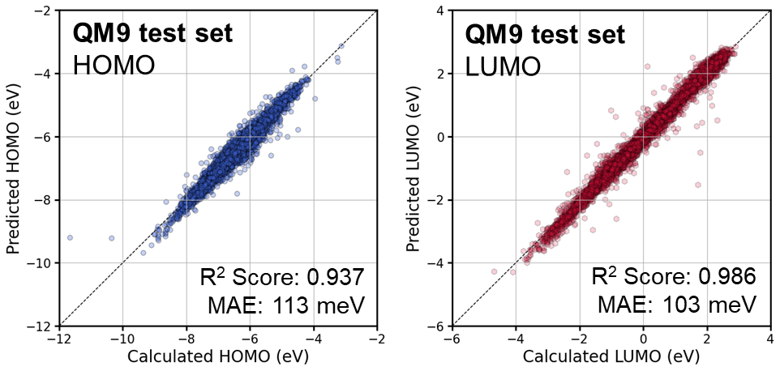

%20%7C%20macOS%20%7C%20Windows-lightgrey?style=plastic&logo=linux&logoColor=white)
[](https://www.python.org/downloads/)
[](https://developer.nvidia.com/cuda-toolkit)

[](https://numpy.org/)
[](https://pandas.pydata.org/)
[](https://github.com/tqdm/tqdm)
[](https://pytorch.org/)
[](https://huggingface.co/docs/transformers/index)

# DyBERT
DyBERT is an enhanced version of the [BaseBERT](https://github.com/wkdghdus23/BaseBERT.git) framework, designed to further improve the learning and prediction of molecular properties through several key enhancements. The primary differences compared to BaseBERT are as follows:

- **Learning Rate Scheduler**: Unlike BaseBERT, DyBERT introduces a learning rate scheduler to better control the training process. This scheduler helps adjust the learning rate dynamically during training.
- **Hybrid Loss Function**: By combining MAE (Mean Absolute Error) and MSE (Mean Squared Error) into a hybrid loss function, DyBERT leverages the strengths of both metrics. MSE is more sensitive to outliers, making it useful for emphasizing larger errors, while MAE is less sensitive to outliers, helping to stabilize the model's learning.

### Platform Support
DyBERT is primarily designed for Linux environments and supports all major platforms including Windows and macOS. While Linux is the recommended environment for optimal performance and ease of using command-line tools, the package is compatible with:
   - **Linux**: Recommended for command-line tools and model training with GPU.
   - **macOS**: Fully supported, but some command-line tools may need adaptation.
   - **Windows**: Python API works well, but Linux-based commands may require adjustment.

### Prerequisites
   - **Python**: Python 3.8 or later (recommended: 3.8+)
   - **CUDA**: CUDA 12.2 or later
   - **PyTorch**: PyTorch 2.4.1 or later. If you plan to use GPU acceleration, make sure the CUDA version is compatible with your PyTorch version. For more details, refer to the [PyTorch website](https://pytorch.org/)
   - **Transformers**: Transformers 4.44.2 or later
   - **NumPy**: NumPy 1.24.3 or later
   - **Pandas**: Pandas 2.0.3 or later
   - **tqdm**: tqdm 4.66.5 or later
   - **Miniconda/Conda**: It is recommended to use Miniconda or Conda to create an isolated environment for this package.

# Table of Contents
- [Installation](#installation)
- [Usage](#usage)
- [Features](#features)
- [License](#license)

# Installation
### 1. Install Miniconda:
If you do not have **Miniconda** installed, you can download it from [Miniconda Downloads](https://docs.conda.io/en/latest/miniconda.html) and follow the installation instructions for your operating system.


### 2. (Optional) Create a virtual environment:
It is recommended to create a virtual environment to manage dependencies.   
   ```bash
   # Create a virtual environment
   conda create -n dybert python=3.8 -y
   
   # Activate the virtual environment**
   conda activate dybert
   ```

### 3. Clone this repository:
If you don't have Git installed, please install it from Git Downloads.
   ```bash
   git clone https://github.com/wkdghdus23/DyBERT.git
   ```

### 4. Move to the basebert folder:
   ```bash
   cd (path/to/your/package)/DyBERT/dybert/
   ```

### 5. Install the package:
   ```bash
   pip install -e .
   ```
**Ensure that your device's GPU CUDA version is compatible with the PyTorch CUDA version.** See the [PyTorch website](https://pytorch.org/) for more information.
To check CUDA version compatibility, you can use the following commands:
   ```bash
   # Check CUDA version installed on your system
   nvidia-smi

   # Check the CUDA version supported by PyTorch
   python -c "import torch; print(torch.version.cuda)"
   ```
   
### 6. Add the Python path to your environment:
**Option 1**: Set `PYTHONPATH` temporarily (recommended for virtual environments)
If you are using a virtual environment (e.g., with Miniconda), you can set the `PYTHONPATH` temporarily within the active session. This means that the path is only available while the environment is activated, which is generally sufficient for development purposes.

   - **Step 1**. Create an activation script that sets the `PYTHONPATH` every time the environment is activated:
   ```bash
   mkdir -p $CONDA_PREFIX/etc/conda/activate.d
   echo "unset PYTHONPATH" >> $CONDA_PREFIX/etc/conda/activate.d/env_vars.sh
   echo "export PYTHONPATH=$PYTHONPATH:(path/to/your/package)/DyBERT/" >> $CONDA_PREFIX/etc/conda/activate.d/env_vars.sh
   ```
   - **Step 2**. Create a deactivation script to unset `PYTHONPATH` when the environment is deactivated:
   ```bash
   mkdir -p $CONDA_PREFIX/etc/conda/deactivate.d
   echo "unset PYTHONPATH" >> $CONDA_PREFIX/etc/conda/deactivate.d/env_vars.sh
   ```
   This will make sure that the `PYTHONPATH` variable is cleared when the environment is deactivated, preventing any unwanted effect on other environments or system-level Python sessions.
   - **Step 3**. Restart your virtual environment
   After adding the activation and deactivation scripts, you need to **deactivate and reactivate** your virtual environment for the changes to take effect.
   You can do this by running:
   ```
   conda deactivate
   conda activate dybert
   ```
   This step is necessary because the environment variables set by the activation script are only applied when the environment is first activated. If you make changes to these scripts, you need to deactivate and reactivate the environment to see those changes reflected.
   
**Option 2**: Set `PYTHONPATH` permanently (not recommended for virtual environments)
If you are not using a virtual environment and want to make `PYTHONPATH` changes permanent across terminal sessions, add the following line to your `.bashrc` or `.zshrc` file:
   ```bash
   echo 'export PYTHONPATH=$PYTHONPATH:(path/to/your/package)/DyBERT/' >> ~/.bashrc
   source ~/.bashrc
   ```
This will ensure that `PYTHONPATH` is set globally every time a new terminal session is started.

**Note**: If you move the location of the DyBERT package, you will need to update the `PYTHONPATH` in your `.bashrc` (or the corresponding activation script for virtual environments) to point to the new path. Not doing this may lead to errors when trying to use the package, as Python won't be able to locate the module files.

### 7. Verify the installation:
   ```bash
   python -c "import dybert; print('DyBERT package installed successfully.')"
   ```

# Usage
### Command Line Arguments
   - `--task`: The task type to perform. Options are:
      - `mlm`: Masked Language Modeling to predict masked tokens.
      - `downstream`: Train a downstream model to predict chemical properties.
   - `--pretrained`: Path to a pre-trained model. Used as the starting point for fine-tuning or `downstream` tasks.
   - `--dataset`: Path to the dataset file in `.csv` format.
   - `--vocabfile`: Path to the vocabulary file used for tokenizing the string data (default: `./vocab.txt`).
   - `--max_len`: The maximum sequence length for tokenization.
   - `--batchsize`: Batch size for training.
   - `--epochs`: Number of epochs for training.
   - `--modelsavepath`: Path where the trained or fine-tuned model will be saved.
   - `--masking`: Masking ratio for MLM tasks. **Only used for the `mlm` task.** This defines the proportion of tokens in the input that will be masked (e.g., `0.15` means 15% of the tokens will be masked).
   - `--target`: List of target properties for downstream tasks. **Only used for the `downstream` task**. Specifies which chemical properties to predict during the downstream task (e.g., `--target HOMO LUMO`).

### Examples
Before running the examples, navigate to the example directory, which contains the QM9 dataset.
   ```bash
   cd (path/to/your/package)/DyBERT/example
   ```

### Task 1. Train the Masked Language Model (MLM) using the QM9 dataset
In this example, you will train a Masked Language Model (MLM) using the QM9 dataset. The MLM task involves masking certain parts of the input data and training the model to predict these masked parts. This helps the model learn contextual embeddings for chemical structures, which can be useful for downstream tasks such as property prediction.

Perform the training task with the following parameters:

   - **Masking ratio**: 15% of the tokens are masked.
   - **Batch size**: 32 (The number of samples processed before the model is updated).
   - **Epochs**: 10 (The number of complete passes through the entire dataset).
   - **Dataset**: QM9 dataset in CSV format.
   ```bash
   dybert --task mlm --masking 0.15 --batchsize 32 --epochs 10 --dataset ./QM9.csv
   ```

### Task 2. Load pre-trained MLM and train the downstream model (HOMO and LUMO values in QM9 dataset)
After training the Masked Language Model, you can use it for downstream tasks. In this example, you will load the pre-trained MLM and train a downstream model to predict the HOMO and LUMO values in the QM9 dataset.

Perform the downstream training task with the following parameters:

   - **Target**: HOMO and LUMO values.
   - **Batch size**: 32 (The number of samples processed before the model is updated).
   - **Epochs**: 20 (The number of complete passes through the entire dataset).
   - **Dataset**: QM9 dataset in CSV format.
   - **Pre-trained Model**: The path to the pre-trained MLM model.
   ```bash
   dybert --task downstream --target HOMO LUMO --batchsize 32 --epochs 20 --dataset ./QM9.csv --pretrained (path/to/pre-trained/model)
   ```

### Model Performance
The performance of the DyBERT was evaluated on the prediction of HOMO and LUMO energy levels. The scatter plots below illustrate the correlation between the calculated and predicted values for the HOMO and LUMO levels.
   - **HOMO Prediction (Left):**
      - R² score: 0.938
      - MAE: 111 meV
   - **LUMO Prediction (Right):**
      - R² score: 0.986
      - MAE: 103 meV



**Note**: Due to the model's biased predictions, a bias of +0.1 eV was arbitrarily added to the predicted HOMO values. This is an issue that needs to be addressed in future model improvements.
 
### Task 3. Load Trained Model and Predict Chemical Properties
This section demonstrates how to **load a pre-trained model** and use it to **predict HOMO and LUMO** properties of given molecules.
   ```python
   import os
   import torch
   from transformers import BertTokenizer
   from dybert.tokenizer import Tokenizer, vocabulary
   from dybert import BertForDownstream
   
   # Check if the vocabulary file exists, if not, create it
   vocab_file_path = './vocab.txt'
   if not os.path.exists(vocab_file_path):
       print(f"Vocabulary file '{vocab_file_path}' not found. Creating vocabulary...")
       vocabulary(path=vocab_file_path)  # Create vocabulary file in the current directory
   
   # Load the pre-trained model and tokenizer
   pretrained_model_path = '(path/to/pretrained/model)'
   tokenizer = BertTokenizer(vocab_file=vocab_file_path, clean_up_tokenization_spaces=True)
   
   # Load the pre-trained downstream model
   model = BertForDownstream.from_pretrained_model(pretrained_path=pretrained_model_path, tokenizer=tokenizer, target_name=['HOMO', 'LUMO'])
   state_dict = [torch.load(os.path.join(pretrained_model_path, f), weights_only=True) for f in os.listdir(pretrained_model_path) if f.endswith('.pt')][0]
   model.load_state_dict(state_dict)
   
   # Prepare the input data (example SMILES strings)
   input_data = ['O=C=O',
                 'C(=O)N',
                 "O=[S][N]S[N][S]=O",
                 'CN1CCN(C)[C@@H](C(Cl)(Cl)Cl)[C@H]1[C]([NH])O']  # Example SMILES strings representing different molecules
   
   # Tokenize the input SMILES strings and prepare inputs for the model
   inputs = Tokenizer(smiles=input_data, vocab_file=vocab_file_path, tokenizer=tokenizer, max_len=256)
   
   # Convert tokenized inputs to PyTorch tensors
   input_ids = torch.tensor(inputs['input_ids'], dtype=torch.long)
   attention_mask = torch.tensor(inputs['attention_mask'], dtype=torch.long)
   
   # Perform prediction
   model.eval()  # Set model to evaluation mode
   with torch.no_grad():  # Disable gradient calculations for inference
       # Make predictions and convert to NumPy array
       outputs = model(input_ids=input_ids, attention_mask=attention_mask).numpy()
   
   # Print predicted properties for each input
   print("Predicted properties:", outputs)
   ```

# Features
- **Masked Language Modeling (MLM)**: Predict masked tokens in strings using a BERT-based architecture.
- **Downstream Property Prediction**: Predict chemical properties using a pre-trained model.
- **Custom Tokenizer for SMILES**: A tokenizer specifically optimized for chemical structure representations in SMILES format.
- **Easy Integration**: Command-line interface (CLI) and Python API for seamless integration into your workflows.
- **GPU Acceleration**: Utilize CUDA-enabled GPUs to significantly speed up training and prediction.
- **Learning Rate Scheduler**: Leaning rate scheduler to better adapt learning rates during training.
- **Dynamic Loss Function**: Combines MAE and MSE loss to leverage the strengths of both metrics.
  
**Note**: This project is designed as an introductory tutorial, allowing users to easily explore and experience BERT-based modeling for molecular property prediction. It aims to provide a straightforward and hands-on approach for beginners interested in machine learning applications in chemistry.

Additionally, DyBERT builds upon [BaseBERT](https://github.com/wkdghdus23/BaseBERT.git), serving as an example of how users can enhance the performance of their models. This tutorial demonstrates step-by-step methods for improving BaseBERT, offering insights and practical guidance for optimizing BERT-based molecular property prediction models.

**At this time, contributions and GitHub issues are not required or actively monitored, as the primary focus is on providing a self-contained tutorial resource.** I appreciate your understanding and hope this project helps you get started with BERT-based modeling.

# License
This project is licensed under the MIT License. See the [LICENSE](LICENSE) file for more details.
